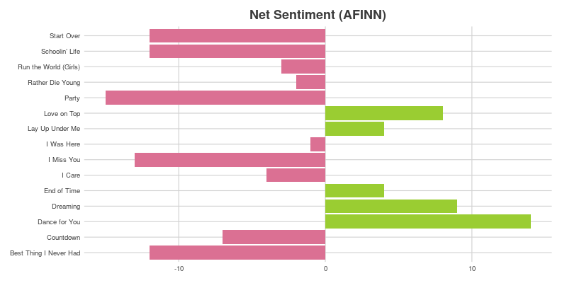

# 141B Final Project: Album Metrics and Sentiment Analysis using Genius and Spotify APIs

Instructor: [Randy Lai](https://visit.randy.city/)

See [shinyapp.io](https://kiwilvio.shinyapps.io/Album_Analysis) for the application demo.

## Introduction

Music is rich for it's ability to not only make one feel different emotions but also enhance your current mood. Some people might put on Taylor Swift's ["All Too Well (10 Minute Version) (Taylor's Version) (From The Vault)"](https://www.youtube.com/watch?v=tollGa3S0o8) while reminiscing about a painful breakup, or it could be time to get up and dance to Billy Joel's [Uptown Girl](https://www.youtube.com/watch?v=hCuMWrfXG4E). Whatever the mood is, I wanted to create something in hopes I can get a little more insight on the artist's intended album narrative and how that narrative is shaped from song to song.

## Implementation Details

I made use of R's [geniusr](https://ewenme.github.io/geniusr/) and [spotifyr](https://www.rcharlie.com/spotifyr/) packages that serve as API wrappers. This greatly simplified the process of pulling the data from the respective APIs so I could focus on the album analysis.

To begin pulling in the data, we call the `get_album_tracklist_search` function from the geniusr package. After getting the tracklist from Genius, we loop through each song on the album to grab the lyrics and concatenate it all into a single data frame (`album_lyrics`).

We use the `unnest_tokens` function from the `tidytext` package, a text mining package in R, to tokenize each song line into the individual words. This is an important step when working with text data because it allows words to be contextualized. And with that, our album lyrics are ready to be analyzed.

Now, we turn our attention to pulling in the spotify metrics. To do this we'll call the `get_artist_audio_features` function from the spotifyr package. This pulls in audio features for an artist's entire discography. Since, we only want to look at a single album, we need to perform an inner join with the album track list we got from the `get_album_tracklist_search` function. The audio features pulled in include: danceability, energy, speechiness, acousticness, instrumentalness, liveness, and valence. Please refer to Spotify's [audio features page](https://developer.spotify.com/documentation/web-api/reference/#/operations/get-several-audio-features) for more information on the individual audio features.

## Examples

A wordcloud for the lyrics of Beyoncé's album *4*

A wordcloud for the positive and negative words on Beyoncé's album *4*

Top 5 words from each track on Beyoncé's album *4*

Each song's "gross sentiment" recording both the positive and negative words for each track on Beyoncé's album *4* using [bing lexicon](https://emilhvitfeldt.github.io/textdata/reference/lexicon_bing.html).

Each song's "net sentiment" comparing the positive words against the negative words for each track on Beyoncé's album *4* using [AFINN lexicon](https://emilhvitfeldt.github.io/textdata/reference/lexicon_afinn.html)

A dendrogram for Beyoncé's album *4*. A Document-Term Matrix (DTM) is a matrix that "describes the frequency of terms that occur in a collection of documents" ([Wikipedia](https://en.wikipedia.org/wiki/Document-term_matrix#:~:text=A%20document%2Dterm%20matrix%20is,and%20columns%20correspond%20to%20terms.)). In this instance, each track is a "document" and each word is a "term". The dendrogram is computed by using the cosine-distance matrix of the DTM and the [Ward2 agglomerative algorithm](https://arxiv.org/pdf/1111.6285.pdf).

Radar chart displaying the sentiments from each track on Beyoncé's album *4* using [NRC Word-Emotion Association Lexicon](https://saifmohammad.com/WebPages/NRC-Emotion-Lexicon.htm).

Sonic score for each track on Beyoncé's album *4*. Sonice score is a unique metric computed as the sum of valence, danceability, and energy. This metric is taken from [Simran Vatsa's tayloR Taylor Swift analysis](https://medium.com/@simranvatsa5/taylor-f656e2a09cc3).

Radar chart displaying Spotify metrics for each track on Beyoncé's album *4*.

Density ridge plots displaying Spotify metrics for Beyoncé's album *4*.

A directional map of the bigrams on Beyoncé's album *4*. This visualization can also be thought of as a Markov chain, a common model in text processing. In a Markov chain each choice of word depends only on the previous word.
